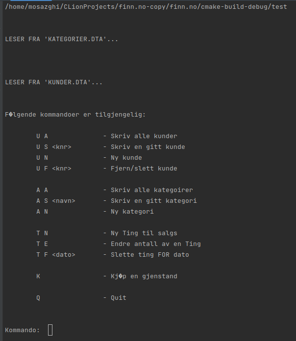
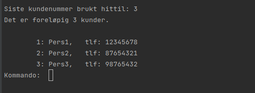
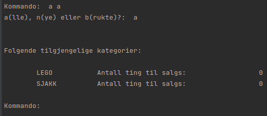

# A project resembling finn.no marketplace
## This project was given as a final project in the subject PROG1003 - Object-oriented programming at NTNU. 
### GitLab was utilized in this project. 
### Additional contributor: https://github.com/AbdiYus

### Be sure to edit the read/write path to `kunder.dta` and `kategorier.dta`, in `kunder.cpp` and `kategorier.cpp` respectively

## Some of the available commands:

